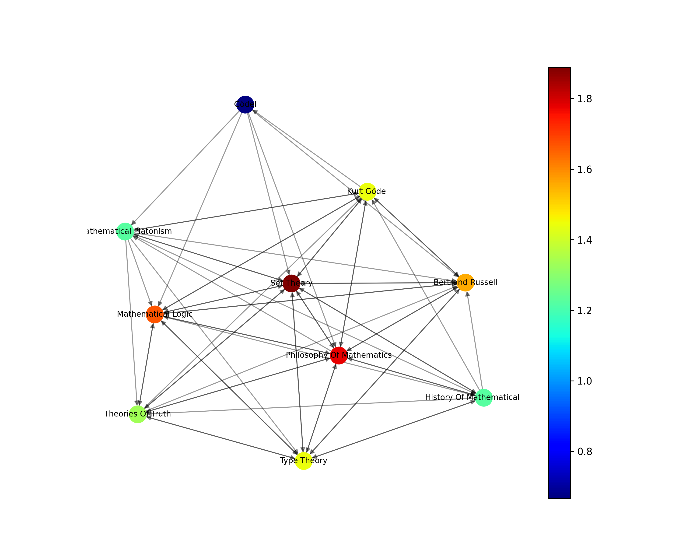
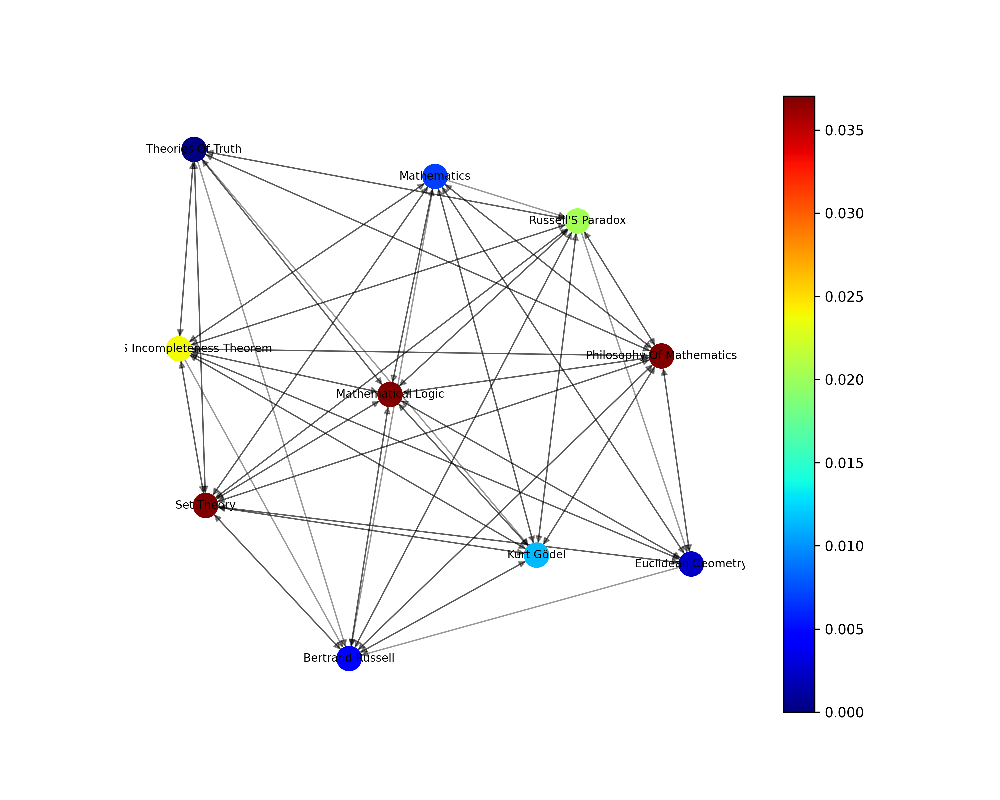

# Wikipedia pages analysis

## Requisitos
- [x] Generate a directed network from wikipedia pages' links. 
- [x] Pick a seed (wikipedia page)
- [x] Generate network metrics plot 
- [x] Generate KDE plot (degree and some other metric)
- [x] Generate pair plot
- [ ] Generate shell and core plot
- [x] Generate data pipeline 

## Introduction 

This project is a component of the Algorithm and Data Structure 2 course offered at the Federal University of Rio Grande do Norte. The main goal of this endeavor is to create a directed network (graph) using links from Wikipedia pages and conduct a comprehensive analysis using network concepts. The process of generating the network begins with a specific Wikipedia page and is limited to a depth level of 2. The selection of Gödel's incompleteness theorems  was made as the basis for generating the network.

## Data Pipeline
The data pipeline comprises four essential tasks. The initial node is responsible for fetching data from a specified seed and building the graph. The subsequent node eliminates any duplicate nodes, while the third node filters out nodes with a degree less than 2. Finally, the last node combines computations and generates plots for various network metrics, including degree centrality, closeness centrality, betweenness centrality, and eigenvector centrality.

## Data Cleaning

The initial version of the directed graph generated from the "Godel Incompleteness Theorems" consisted of 24,342 nodes and 119,354 edges. After removing duplicates, the graph was refined to 24,090 nodes and 119,049 edges. Finally, by filtering out all nodes with a degree of one, the resulting graph was reduced to 5,447 nodes and 97,550 edges.

## Network Metrics

### Degree Centrality
Measures the number of connections (edges) that a node has in a network, relative to the total number of possible connections. It represents the importance or influence of a node based on the proportion of direct connections it has compared to all possible connections in the network. Nodes with higher degree centrality are often considered more central or influential in the network.

Top 10 nodes with higher degree centrality:

### Closeness Centrality
Quantifies how close a node is to all other nodes in a network. It measures the average shortest path length from a node to all other nodes. Nodes with high closeness centrality are typically able to reach other nodes quickly and efficiently, acting as information brokers or bridges in the network.

Top 10 nodes with higher closeness centrality:

### Betweenness Centrality
Identifies nodes that act as intermediaries or bridges between other nodes in a network. It quantifies how often a node lies on the shortest paths between pairs of nodes. Nodes with high betweenness centrality have significant control over information flow and can facilitate communication between disparate parts of the network.

Top 10 nodes with higher betweenness centrality:

### Eigenvector Centrality
Assigns a measure of importance to nodes based on both their direct connections and the importance of those connections. It takes into account the centrality of a node's neighbors, assigning higher scores to nodes connected to other highly central nodes. Nodes with high eigenvector centrality are influential due to their connections to other influential nodes.

Top 10 nodes with higher eigenvector centrality:

### K-core and K-shell
The greatest k-core within this network was determined to be 393, signifying a highly connected group of nodes. This k-core represents a cohesive subset of pages that are intricately interconnected with each other.

Furthermore, the greatest k-shell within this network was found to have a value of 294. A k-shell refers to a subset of nodes that possess a minimum degree within the network. In this case, the k-shell of 294 represents a significant group of nodes with a minimal number of connections to the rest of the network.

These discoveries shed light on the intricate structure and interdependencies within the network of Wikipedia pages stemming from the Gödel Incompleteness Theorems. The existence of such a robust k-core and k-shell underscores the interconnected nature of the topics and concepts associated with this prominent mathematical theorem.

## Probability Distributions 
Firstly, focusing on the degree distribution, the probability density function (PDF) reveals that the majority of nodes exhibit degrees ranging from 0 to 50. This suggests that a significant portion of pages within the network have relatively low connectivity. However, intriguingly, there is a small curve in the PDF that emerges between the range of 400 and 600. This indicates the presence of a subset of nodes with notably high degrees, signifying a group of pages with a substantial number of connections. These nodes with high degrees play a crucial role in facilitating information flow and connecting disparate topics within the network.

Similarly, when examining the PDF of eigenvector centrality, a similar trend emerges. The majority of nodes are distributed around low values of eigenvector centrality, indicating that most pages have limited influence or prominence within the network. However, there are notable exceptions, as evidenced by the presence of nodes with high eigenvector centrality values. These nodes hold significant importance in terms of their influence and centrality within the network, likely representing key topics or foundational concepts that have a widespread impact on other pages.

In summary, the probability distributions of the degree and eigenvector centrality within the network of Wikipedia pages starting from the Gödel Incompleteness Theorems demonstrate a pattern of most nodes having low values, while a subset of nodes exhibit high degrees and eigenvector centrality. These distributions highlight the varying levels of connectivity and influence within the network, emphasizing the significance of certain nodes in shaping the overall structure and flow of information within this domain.

## Pair Plot with network metrics
Upon examining the pair plot of network metrics within the directed network of Wikipedia pages, starting from the Gödel Incompleteness Theorems, some intriguing patterns have emerged. While the pair plot may not provide comprehensive insights into the network's overall structure, it does reveal notable correlations between certain metrics and suggests the presence of distinct clusters within the data.

Firstly, the pair plot indicates a correlation between betweenness and degree. This correlation implies that nodes with higher degrees tend to have a greater influence in terms of information flow within the network. Nodes with higher degrees often act as crucial bridges, connecting disparate topics and facilitating the transfer of knowledge across different areas.

Similarly, the pair plot reveals a correlation between eigenvector centrality and closeness. This correlation suggests that nodes with higher eigenvector centrality tend to have a closer proximity to other nodes within the network. This proximity allows these nodes to have more efficient and direct access to information, enhancing their overall centrality and influence within the network.

Moreover, the eigenvector column in the pair plot demonstrates the presence of two distinct clusters. The first cluster represents more popular nodes, characterized by higher eigenvector centrality values. These popular nodes likely correspond to topics or concepts that have garnered significant attention and prominence within the network. Conversely, the second cluster represents a larger group of nodes that are relatively less popular, with lower eigenvector centrality values. These nodes may correspond to less widely known or niche topics within the network.

